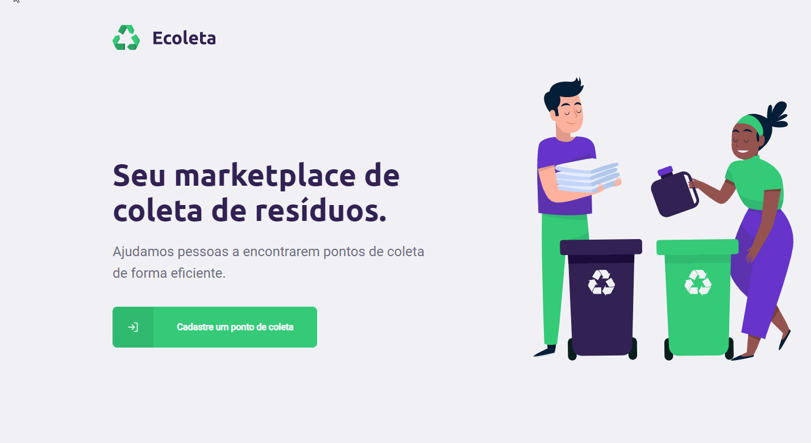

<h1 align="center">
  
</h1>

<p align="center">
  
  
</p>

<p align="center">
  
</p>

<!-- <p align="center">
  
</p> -->

## :memo: Projeto

Essa aplicação permite o cadastro de pontos de coleta de produtos como lâmpadas, pilhas, resíduos eletrônicos, óleo de cozinha... A aplicação possui funcionalidades interessantes, como a integração com a api do IBGE e de um mapa open source, o OpenStreetMap.

## :rocket: Tecnologias

- [Node.js](https://nodejs.org/en/)
- [React](https://reactjs.org)
- [React Native](https://facebook.github.io/react-native/)
- [Expo](https://expo.io/)

## :gear: Rodando o projeto
``` bash
  $git clone https://github.com/frapimoneto/NLW
  $cd NLW
  $cd server
  $yarn
  $yarn start
  $cd web
  $yarn
  $yarn start
  $cd mobile
  $yarn
  $yarn start
```

Feito com ❤ por Francisco Pinto Moreira Neto 😃 [Get in touch!](https://github.com/frapimoneto)